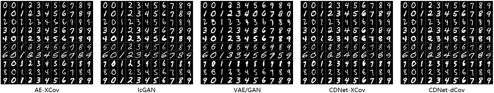
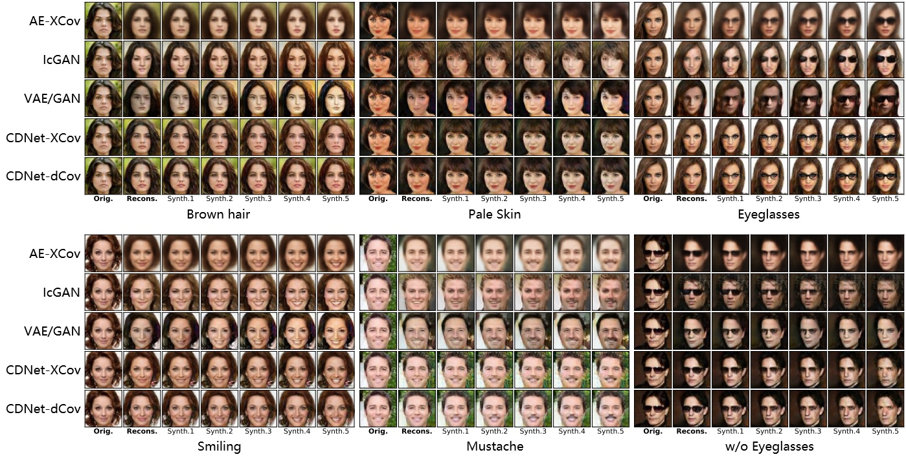
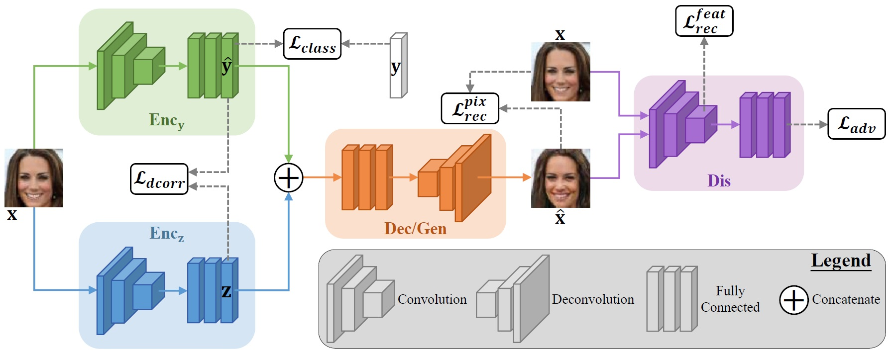

## CDNet
This repository provides a PyTorch implementation of [CDNet](https://arxiv.org/abs/2001.08572). CDNet can be used to disentangle the digits’ handwriting style from the content information, and synthesize new faces with the same object identity but with different facial attributes and attribute intensities: <br/>





## Paper
Toward a Controllable Disentanglement Network <br/>
[Zengjie Song](https://zjsong.github.io/)<sup>1</sup>, [Oluwasanmi Koyejo](http://sanmi.cs.illinois.edu/)<sup>2</sup>, [Jiangshe Zhang](http://gr.xjtu.edu.cn/web/jszhang/english)<sup>1</sup> <br/>
<sup>1</sup>School of Mathematics and Statistics, Xi’an Jiaotong University, Xi’an, China <br/>
<sup>2</sup>Department of Computer Science, University of Illinois at Urbana-Champaign, Urbana, IL, USA <br/>
IEEE Transactions on Cybernetics (T-CYB), 2020 <br/>
[PDF](https://ieeexplore.ieee.org/abstract/document/9141386) | [arXiv](https://arxiv.org/abs/2001.08572) <br/>

> **Abstract:** *This paper addresses two crucial problems of learning disentangled image representations, namely controlling the degree of disentanglement during image editing, and balancing the disentanglement strength and the reconstruction quality. To encourage disentanglement, we devise a distance covariance based decorrelation regularization. Further, for the reconstruction step, our model leverages a soft target representation combined with the latent image code. By exploring the real-valued space of the soft target representation, we are able to synthesize novel images with the designated properties. To improve the perceptual quality of images generated by autoencoder (AE)-based models, we extend the encoder-decoder architecture with the generative adversarial network (GAN) by collapsing the AE decoder and the GAN generator into one. We also design a classification based protocol to quantitatively evaluate the disentanglement strength of our model. Experimental results showcase the benefits of the proposed model.*


## Overview of network architecture for training



## Dependencies
* [Python 3.7+](https://www.python.org/downloads/)
* [PyTorch 0.4.1+](http://pytorch.org/)
* [Visdom](https://github.com/facebookresearch/visdom) (optional for visualizing training states)


## Downloading & pre-processing CelebA dataset
To download the CelebA dataset, please visit [the official website](http://mmlab.ie.cuhk.edu.hk/projects/CelebA.html). We use the clipped face images (64x64x3) and all 40 facial attributes (represented by a binary vector) to train all models. To pre-process images and labels, run the following code in ```src```:
```
python data_preprocess.py
```

**Note**: For both data pre-processing and model training, you need to modify the saving or the downloading path first.


## Training
```bash
#######################################################
# Train proposed models: CDNet-XCov or CDNet-dCov
#######################################################
# The decorrelation regularization is swithed between XCov and dCov 
# by commenting one of the fllowing two snippets:
decorr_regul = XCov().to(device)
decorr_regul = dCov2().to(device)

# Traning with default settings:
python cdnet_main.py

#######################################################
# Train AE-XCov
#######################################################
python aexcov_main.py

#######################################################
# Train IcGAN
#######################################################
python icgan_main.py

#######################################################
# Train VAE/GAN
#######################################################
python vaegan_main.py
```


## Citation
If you use this code for your research, please cite our paper:
```
@article{song2020toward,
  title={Toward a controllable disentanglement network},
  author={Song, Zengjie and Koyejo, Oluwasanmi and Zhang, Jiangshe},
  journal={IEEE Transactions on Cybernetics},
  volume={52},
  number={4},
  pages={2491--2504},
  year={2020}
}
```

For the baseline models mentioned before, please refer to the following papers for details:
* AE-XCov: [Discovering hidden factors of variation in deep networks](https://arxiv.org/pdf/1412.6583.pdf)

* IcGAN: [Invertible conditional gans for image editing](https://arxiv.org/pdf/1611.06355.pdf)

* VAE/GAN: [Autoencoding beyond pixels using a learned similarity metric](http://proceedings.mlr.press/v48/larsen16.pdf)


## Acknowledgement
Our code is developed based on [VAEGAN-PYTORCH](https://github.com/lucabergamini/VAEGAN-PYTORCH#vaegan-pytorch). <br/>
The authors also thank Microsoft Azure for computing resources.

